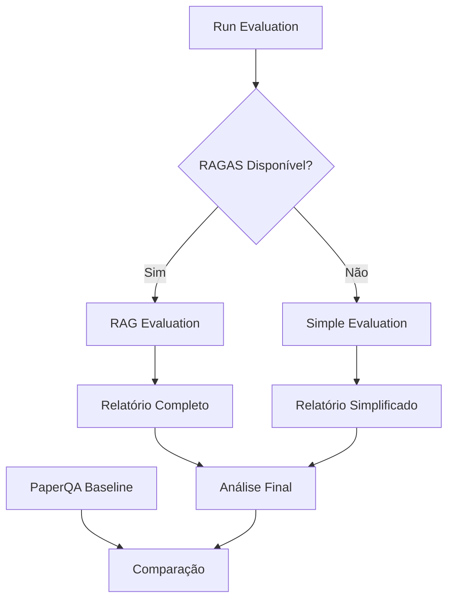

# Documentação do Sistema de Avaliação RAG - Autismo

## Visão Geral

Esta documentação cobre todos os módulos do sistema de avaliação para o assistente RAG especializado em autismo, incluindo implementações completas e simplificadas, baselines de comparação e ferramentas de instalação.

## Estrutura da Documentação

### Módulos Principais

#### 1. [RAG Evaluation](rag_evaluation.md)
Sistema completo de avaliação usando RAGAS com métricas de faithfulness e answer relevancy.

**Características:**
- Avaliação com framework RAGAS
- Métricas avançadas de qualidade
- Relatórios detalhados
- Análise por domínio

**Arquivo:** `eval/rag_evaluation.py`

#### 2. [Simple RAG Evaluation](simple_eval.md)
Sistema de avaliação simplificado sem dependências externas pesadas.

**Características:**
- Avaliação básica sem RAGAS
- Métricas customizadas
- Baixa dependência
- Execução rápida

**Arquivo:** `eval/simple_eval.py`

#### 3. [PaperQA Baseline](paperqa_baseline.md)
Baseline de alta precisão usando PaperQA2 para comparação.

**Características:**
- Baseline de referência
- Alta precisão em documentos científicos
- Comparação automática
- Métricas de performance

**Arquivo:** `eval/paperqa_baseline.py`

### Ferramentas de Execução

#### 4. [Run Evaluation](run_evaluation.md)
Script principal de execução com detecção automática de dependências.

**Características:**
- Detecção automática de dependências
- Fallback inteligente
- Execução adaptativa
- Tratamento robusto de erros

**Arquivo:** `eval/run_evaluation.py`

#### 5. [Install Dependencies](install_dependencies.md)
Ferramenta de instalação automática de dependências.

**Características:**
- Instalação automática
- Verificação de sucesso
- Feedback detalhado
- Tratamento de erros

**Arquivo:** `eval/install_dependencies.py`

## Arquitetura Geral

### Fluxo de Avaliação



### Hierarquia de Dependências

```
Install Dependencies
    ↓
Run Evaluation
    ├── RAG Evaluation (se RAGAS disponível)
    └── Simple Evaluation (fallback)
    ↓
PaperQA Baseline (opcional)
    ↓
Relatórios Finais
```

## Métricas Implementadas

### RAGAS (Completa)
- **Faithfulness**: Fidelidade às fontes
- **Answer Relevancy**: Relevância da resposta

### Customizadas (Simplificada)
- **Taxa de Sucesso**: Respostas válidas
- **Taxa de Citações**: Presença de fontes
- **Taxa de Disclaimers**: Alertas de segurança
- **Taxa de Palavras-chave**: Matching esperado

### Por Domínio
- **Saúde**: Precisão em questões médicas
- **Direito**: Precisão em questões legais
- **Educação**: Precisão em questões educacionais

## Casos de Uso

### Desenvolvimento
```bash
# Instalação e execução completa
python eval/install_dependencies.py
python eval/run_evaluation.py
```

### Produção
```bash
# Execução adaptativa
python eval/run_evaluation.py
```

### Comparação
```bash
# Baseline de referência
python eval/paperqa_baseline.py
```

### Teste Rápido
```bash
# Avaliação simplificada
python eval/simple_eval.py
```

## Configuração

### Variáveis de Ambiente
```bash
OPENAI_API_KEY=sua_chave_aqui
HUGGINGFACE_API_KEY=sua_chave_aqui  # Opcional
```

### Dependências Mínimas
```bash
pip install openai>=1.3.0
pip install langchain>=0.3.0
pip install chromadb>=1.0.0
```

### Dependências Completas
```bash
python eval/install_dependencies.py
```

## Saídas

### Relatórios
- **eval/report.md**: Relatório completo (RAGAS)
- **eval/simple_report.md**: Relatório simplificado
- **eval/results.json**: Resultados estruturados

### Logs
- Console: Progresso e resumos
- Arquivos: Logs detalhados (se configurado)

## Troubleshooting

### Problemas Comuns

#### 1. Dependências Não Encontradas
```bash
# Instalar automaticamente
python eval/install_dependencies.py
```

#### 2. Erro de API Key
```bash
# Verificar variáveis de ambiente
echo $OPENAI_API_KEY
```

#### 3. Problemas de Embeddings
```bash
# Verificar configuração do ChromaDB
ls -la chroma_db/
```

### Diagnóstico
1. Verificar logs de erro
2. Validar dependências
3. Testar módulos individuais
4. Verificar configuração

## Contribuição

### Padrões
- Documentação em português
- Código limpo sem comentários
- Tratamento robusto de erros
- Logs informativos

### Processo
1. Implementar funcionalidade
2. Remover comentários do código
3. Criar documentação oficial
4. Atualizar este índice

## Versionamento

- **v1.0**: Implementação inicial
- **v1.1**: Adição de RAGAS
- **v1.2**: Baseline PaperQA2
- **v1.3**: Documentação completa

## Suporte

### Recursos
- Documentação completa de cada módulo
- Exemplos de uso
- Troubleshooting detalhado
- Guias de configuração

### Contato
- Issues: GitHub repository
- Documentação: Este diretório
- Exemplos: Arquivos de código

---

*Documentação do Sistema de Avaliação RAG - Autismo v1.0*